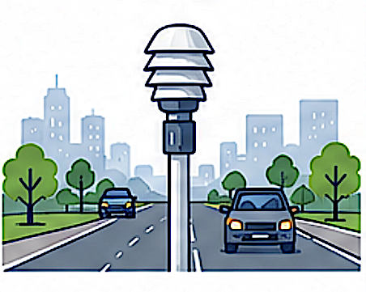
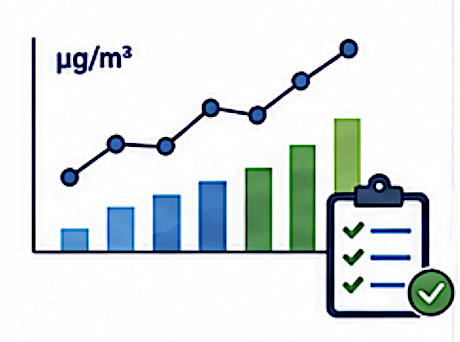

# Tables

Select a reporting table below to view its structure, attributes and examples.

```{toctree}
:hidden:
:maxdepth: 1

Authority
MeasurementStation
SamplingPoint
SamplingPointLocation
SamplingProcess
ModelObjectiveEstimation
ObservationMeasurementResult
MOEResultInline
MOEResultExternal
AssessmentRegimeZone
ZoneGeometry
ComplianceAssessmentMethod
SpatialRepresentativeness
SRSInline
SRSExternal
PollutionLevelAdjustment
CompliancePlanLink
PlanScenario
SourceApportionment
ScenarioMeasure
Measure
Documentation
ObservationMeasurementResultPNSD
```

<div class="reporting-table-grid">

<a class="reporting-table-card" href="Authority.html">
<span class="reporting-table-title">Authority</span>
<span class="reporting-table-image">

</span>
</a>

<a class="reporting-table-card" href="MeasurementStation.html">
<span class="reporting-table-title">MeasurementStation</span>
<span class="reporting-table-image">

</span>
</a>

<a class="reporting-table-card" href="SamplingPoint.html">
<span class="reporting-table-title">SamplingPoint</span>
<span class="reporting-table-image">

</span>
</a>

<a class="reporting-table-card" href="SamplingPointLocation.html">
<span class="reporting-table-title">SamplingPointLocation</span>
<span class="reporting-table-image">

</span>
</a>

<a class="reporting-table-card" href="SamplingProcess.html">
<span class="reporting-table-title">SamplingProcess</span>
<span class="reporting-table-image">

</span>
</a>

<a class="reporting-table-card" href="ModelObjectiveEstimation.html">
<span class="reporting-table-title">ModelObjectiveEstimation</span>
<span class="reporting-table-image">

</span>
</a>

<a class="reporting-table-card" href="ObservationMeasurementResult.html">
<span class="reporting-table-title">ObservationMeasurementResult</span>
<span class="reporting-table-image">

</span>
</a>

<a class="reporting-table-card" href="MOEResultInline.html">
<span class="reporting-table-title">MOEResultInline</span>
<span class="reporting-table-image">

</span>
</a>

<a class="reporting-table-card" href="MOEResultExternal.html">
<span class="reporting-table-title">MOEResultExternal</span>
<span class="reporting-table-image">

</span>
</a>

<a class="reporting-table-card" href="AssessmentRegimeZone.html">
<span class="reporting-table-title">AssessmentRegimeZone</span>
<span class="reporting-table-image">

</span>
</a>

<a class="reporting-table-card" href="ZoneGeometry.html">
<span class="reporting-table-title">ZoneGeometry</span>
<span class="reporting-table-image">

</span>
</a>

<a class="reporting-table-card" href="ComplianceAssessmentMethod.html">
<span class="reporting-table-title">ComplianceAssessmentMethod</span>
<span class="reporting-table-image">

</span>
</a>

<a class="reporting-table-card" href="SpatialRepresentativeness.html">
<span class="reporting-table-title">SpatialRepresentativeness</span>
<span class="reporting-table-image">

</span>
</a>

<a class="reporting-table-card" href="SRSInline.html">
<span class="reporting-table-title">SRSInline</span>
<span class="reporting-table-image">

</span>
</a>

<a class="reporting-table-card" href="SRSExternal.html">
<span class="reporting-table-title">SRSExternal</span>
<span class="reporting-table-image">

</span>
</a>

<a class="reporting-table-card" href="PollutionLevelAdjustment.html">
<span class="reporting-table-title">PollutionLevelAdjustment</span>
<span class="reporting-table-image">

</span>
</a>

<a class="reporting-table-card" href="CompliancePlanLink.html">
<span class="reporting-table-title">CompliancePlanLink</span>
<span class="reporting-table-image">

</span>
</a>

<a class="reporting-table-card" href="PlanScenario.html">
<span class="reporting-table-title">PlanScenario</span>
<span class="reporting-table-image">

</span>
</a>

<a class="reporting-table-card" href="SourceApportionment.html">
<span class="reporting-table-title">SourceApportionment</span>
<span class="reporting-table-image">

</span>
</a>

<a class="reporting-table-card" href="ScenarioMeasure.html">
<span class="reporting-table-title">ScenarioMeasure</span>
<span class="reporting-table-image">

</span>
</a>

<a class="reporting-table-card" href="Measure.html">
<span class="reporting-table-title">Measure</span>
<span class="reporting-table-image">

</span>
</a>

<a class="reporting-table-card" href="Documentation.html">
<span class="reporting-table-title">Documentation</span>
<span class="reporting-table-image">

</span>
</a>

<a class="reporting-table-card" href="ObservationMeasurementResultPNSD.html">
<span class="reporting-table-title">ObservationMeasurementResultPNSD</span>
<span class="reporting-table-image">

</span>
</a>

</div>